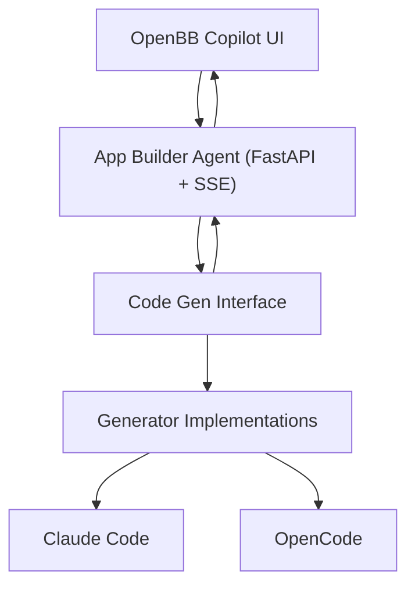

```mermaid
graph TD
    A["OpenBB Copilot UI"] --> B["App Builder Agent (FastAPI + SSE)"]
    B --> C["Code Gen Interface"]
    C --> B
    B --> A
    C --> D["Generator Implementations"]
    D --> E["Claude Code"]
    D --> F["OpenCode"]
```